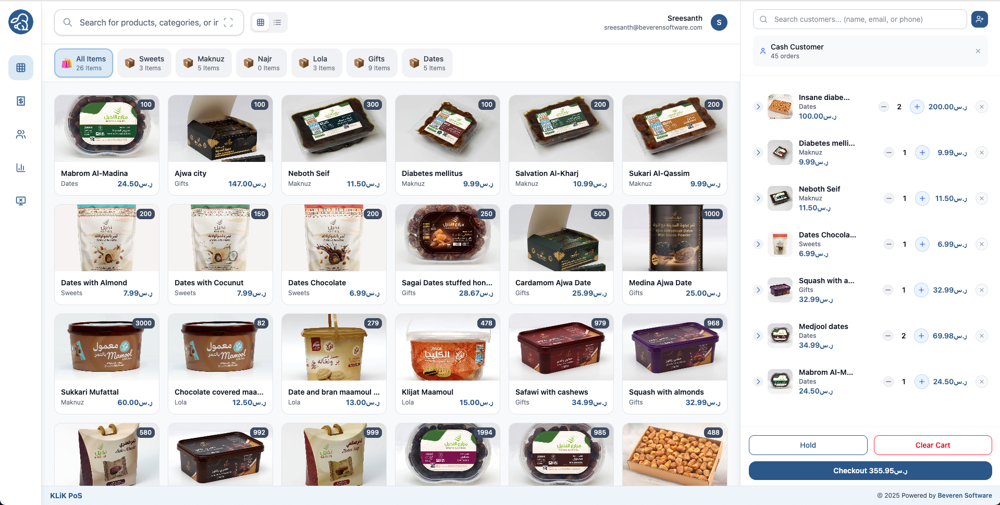
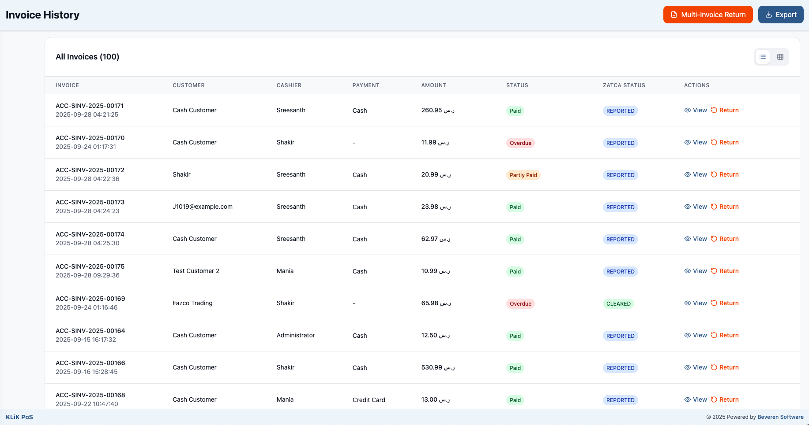

<div align="center" markdown="1">

<!--  -->
<h1>KLiK PoS</h1>
[](https://github.com/Beveren-Software-Inc/KLiK_PoS/actions/workflows/ci.yaml) <br>
**Modern Point of Sale for Retail Businesses**


</div>

<div align="center">
	
</div>
<br />
<div align="center">
	<a href="https://beverensoftware.com/">Website</a>
	-
	<a href="https://github.com/Beveren-Software-Inc/klik_pos">Documentation</a>
</div>

---

## KLiK PoS
KLiK PoS is a 100% open-source Point of Sale for ERPNext - simple, modern, responsive, and feature-rich system designed for retail businesses.

---

### Motivation
The default ERPNext PoS often fall short. They lack strong UX design, miss key compliance requirements (such as ZATCA tax regulations), and have limited social media integration—resulting in a subpar overall experience. Many of ERPNext’s older POS solutions are outdated, don’t support newer versions (v15 and above), and no longer meet today’s business needs.

KLiK PoS was built to close this gap—offering a simple, modern, compliant, and feature-rich POS system designed specifically for ERPNext. Our goal is to deliver a seamless, enjoyable checkout experience—whether in-store or on the go—empowering sales teams to sell smarter, stay compliant, and serve customers with speed and confidence.

---

### Key Features

- **ZATCA Compliance**: Built-in ZATCA compliance by default for Saudi Arabian tax regulations
- **Flexible Sales Modes**: Supports B2C, B2B, or hybrid modes to suit different business needs
- **Smart Invoice Sharing**: Native Email, WhatsApp, and SMS integration for seamless invoice delivery
- **Barcode Scanner Mode**: Dedicated scanner-only mode for fast sales through barcode scanning
- **Multi-Invoice Credit Notes**: Create credit notes for single or multiple invoices effortlessly
- **Customer Management**: Create or edit individual or business customers directly from PoS
- **Payment Processing**: Support for multiple payment methods with seamless round-off (write-off) handling

After installing KLiK PoS, a few extra configurations are required inside **POS Profile** and **KLiK PoS Settings** to unlock the full functionality.

### POS Profile Settings

Navigate to **POS Profile** in ERPNext and configure the following fields:


-   **Business Type**
    Defines the type of customer allowed in the POS:

    -   **B2C** → For walk-in individual customers. Payment is required immediately at checkout.

    -   **B2B** → For company customers. Sales can be completed on credit (Can make instant payment, partial payment or pay later).

    -   **B2C & B2B** → Both types allowed.
        This directly controls how customers are fetched (Individual vs. Company) and whether credit sales are permitted.

-   **POS Print Format**
    Select the print format to use when an invoice is submitted.

    -   Default: Thermal printer–friendly format.

    -   Custom formats: You may create your own print formats and select them here.

-   **Email Template**
    Used when sending invoices via email.

    -   If blank, a default template is used.

    -   Recommended: Define your own email template for a consistent branding experience.

-   **WhatsApp Template**
 

    Used when sharing invoices via WhatsApp.

    -   Templates must be registered and approved in the **WhatsApp Template** doctype.

    -   If left blank, a fallback default will be used.

-   **Default View**
Defines how items are displayed on the POS screen:
        

    -   **List View** → Compact list-style layout.

    -   **Grid View** → Grid-style product cards (recommended for retail).

-   **Hide Expected Amount**
    Controls cashier visibility at POS closing shift:

    -   Enabled → Cashiers do not see the day’s expected sales amount; they must enter their counted cash manually.

    -   Disabled → Cashiers see the expected amount before submitting closing entry.
        _Admins and System Managers always have full visibility regardless of this setting._

-   **Enable WhatsApp / Enable SMS**

    -   Enable these only if WhatsApp or SMS gateways are properly configured.

    -   If not configured, leave unchecked to avoid errors during invoice sharing.

-   **Use Scanner Fully**

    -   When enabled, items can only be added via barcode scanner.

    -   Disables manual click-based item selection.

    -   If the scanner fails, users can still click the scanner icon in the search bar to enter a barcode manually.


---
### ZATCA Compliance
KLiK PoS is fully compliant with ZATCA regulations for B2B and B2C invoices, as well as credit notes. The system has been validated and tested with the [Beveren ZATCA Integration App](https://github.com/Beveren-Software-Inc/zatca_integration).

Saudi retailers can install both applications together to achieve ZATCA Phase 2 compliance effortlessly. KLiK PoS has been successfully adopted by numerous retail businesses, including some of the largest Dates Distributor companies in the Kingdom.

<div align="center">
	
</div>
<br />

---
### Under the Hood

- [**React 19**](https://react.dev/) + [**TypeScript**](https://www.typescriptlang.org/)
- [**Vite**](https://vitejs.dev/) for lightning-fast builds
- [**Tailwind CSS**](https://tailwindcss.com/) for styling
- [**Zustand**](https://zustand-demo.pmnd.rs/) for state management
- [**ERPNext API**](https://frappeframework.com/) integration

---

## Production Setup

### Managed Hosting
Try KLiK PoS on [Frappe Cloud](https://frappecloud.com) for a hassle-free, secure, and scalable deployment.

### Self Hosting

**Step 1:** Install the app using bench

```bash
cd $PATH_TO_YOUR_BENCH
bench get-app https://github.com/beverensoftware/klik_pos --branch develop
bench install-app klik_pos
```

**Step 2:** Start your bench

```bash
bench start
```

**Step 3:** Access the POS at `http://your-site:8000/klik_pos`

---

## Development Setup

### Backend (Frappe App)

1. [Install Frappe/ERPNext](https://frappeframework.com/docs/v15/user/en/installation)
2. Install KLiK PoS as above
3. Run `bench start`

### Frontend (SPA)

1. Clone the SPA repo:
    ```bash
    git clone https://github.com/beverensoftware/klik_spa.git
    cd klik_spa
    ```
2. Install dependencies:
    ```bash
    npm install
    # or
    yarn install
    ```
3. Start the dev server:
    ```bash
    npm run dev
    # or
    yarn dev
    ```
4. Open [http://localhost:5173](http://localhost:5173) in your browser.

---

## Contributing

1. Fork the repository
2. Create a feature branch (`git checkout -b feature/amazing-feature`)
3. Commit your changes (`git commit -m 'Add amazing feature'`)
4. Push to the branch (`git push origin feature/amazing-feature`)
5. Open a Pull Request

This app uses `pre-commit` for code formatting and linting.
Install and enable it:

```bash
cd apps/klik_pos
pre-commit install
```

---

## Support

For support and questions, please contact the development team at [info@beverensoftware.com](mailto:info@beverensoftware.com).

---

<div align="center">
	<a href="https://beverensoftware.com" target="_blank">
		
	</a>
</div>
